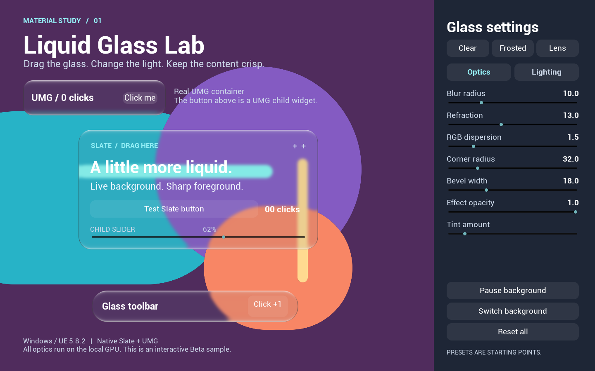
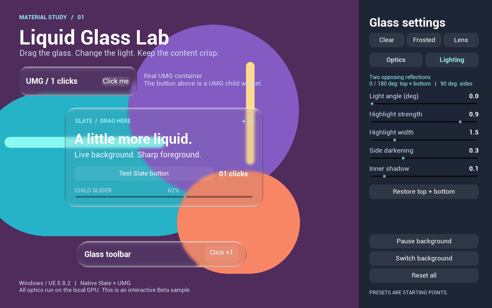
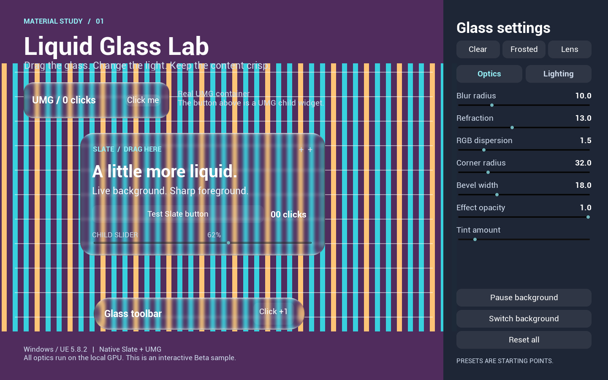
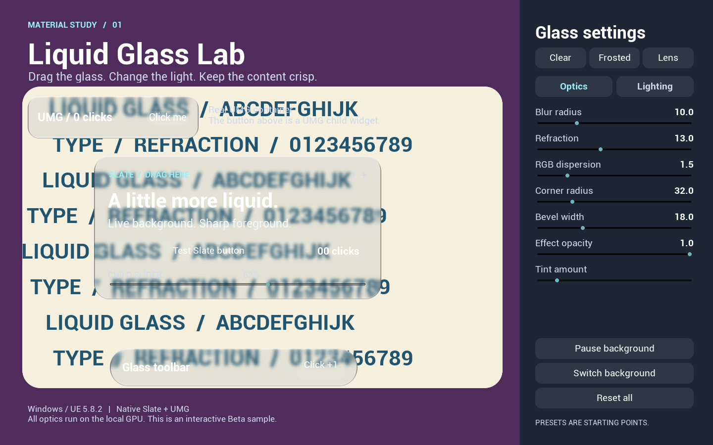
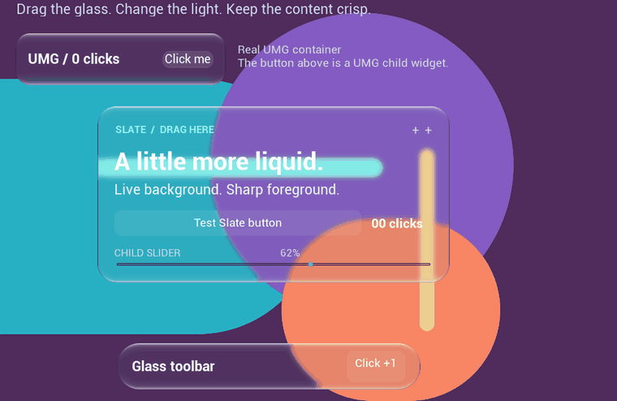
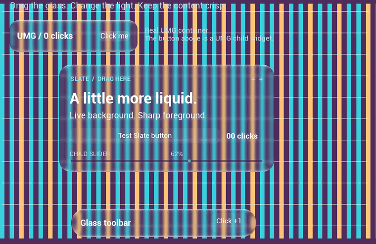
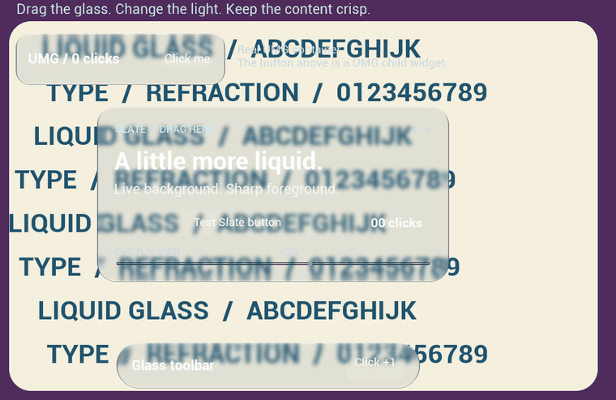

# Liquid Glass UI

UE 5.8 的 UMG / Slate 液态玻璃插件，附带可交互的参数调试工具。支持实时调整模糊、折射、色散、圆角和光照，切换 Clear / Frosted / Lens 预设与背景，并测试 UMG / Slate 按钮和滑块。

## 工具界面

**光学参数**：拖动玻璃卡片，实时调整模糊、折射、色散和透明度。

**光照参数**：调整光源方向、高光强度、亮边宽度和灰边强度。

**网格背景**：观察玻璃边缘的折射、色散和背景模糊。

**文字背景**：对比背景文字模糊与玻璃上方清晰的前景控件。

查看动态效果

## 启动

1. 安装 **Unreal Engine 5.8** 和支持 UE 的 **Visual Studio C++ 工具链**。
2. 下载源码，解压到英文路径。右键 `LiquidGlassDemo.uproject` 生成 Visual Studio 工程，编译 **Development Editor / Win64**。
3. 双击 `LiquidGlassDemo.uproject`，进入编辑器后点击 **Play**。

已有编译结果时，也可以双击 `Start-Demo.cmd` 直接运行示例。若有 Windows 打包版，直接双击 `LiquidGlassDemo.exe`。

拖动玻璃卡片，或在右侧调整模糊、折射和光照。默认上下亮、两侧为细灰边；**Reset all** 恢复默认效果。

要在自己的工程使用，将 `Plugins/LiquidGlassUI` 复制到工程的 `Plugins` 目录并编译，在 UMG 中添加 **Liquid Glass Panel** 即可。详见[插件用法](Plugins/LiquidGlassUI/README.md)。

当前验证平台：Windows / D3D12 / SDR。

许可证：[MIT](LICENSE)。UE 引擎及其附带资源仍适用各自的许可。
